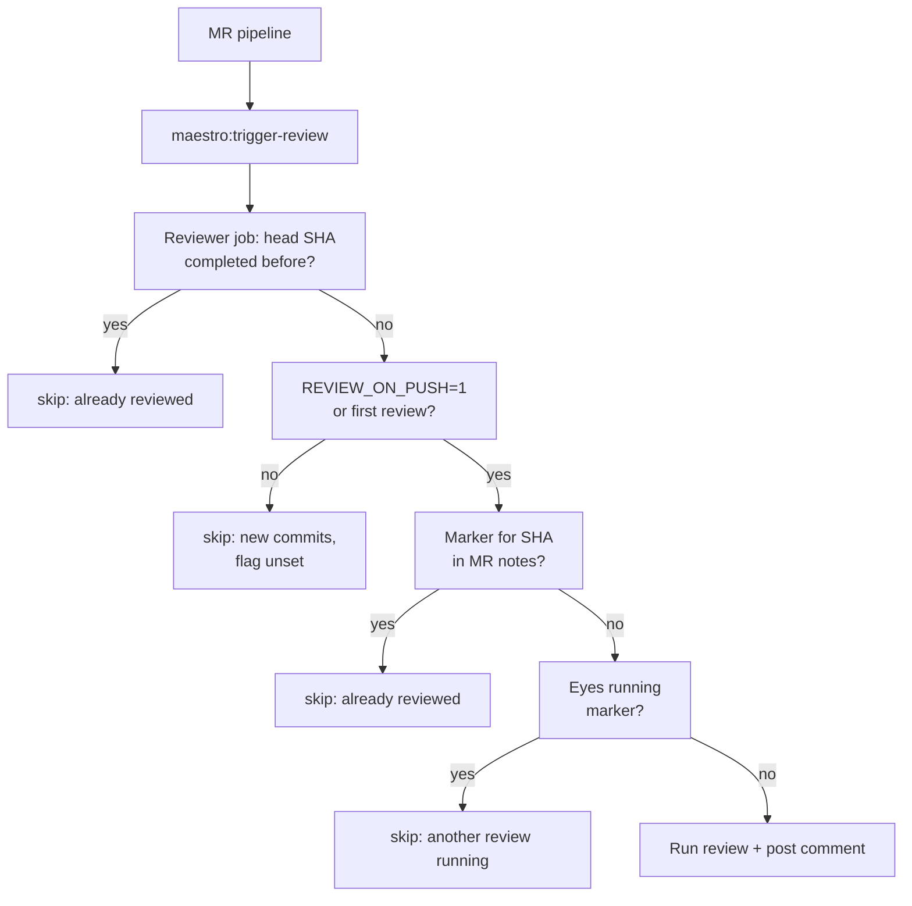
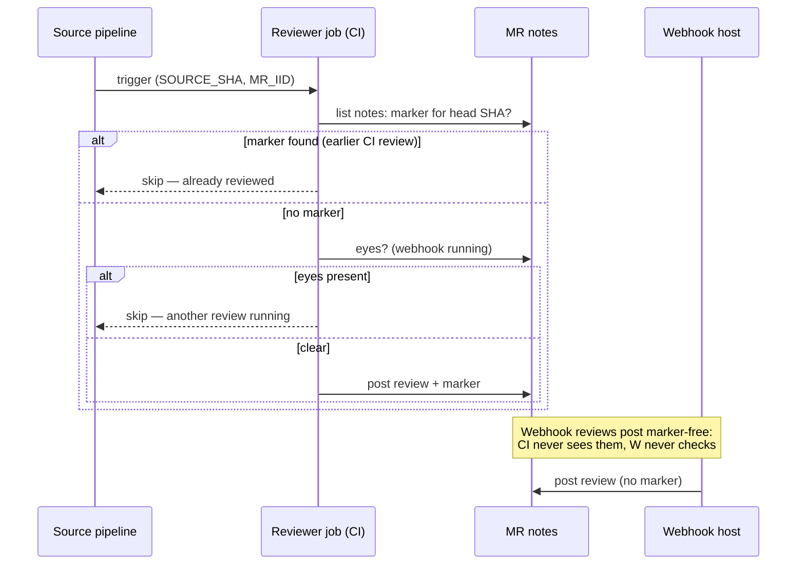

# CI Reviewer — Setup & Per-Case Guide

Run Maestro MR reviews from GitLab CI with zero project-local setup: one
**shared reviewer project** holds all secrets and the reviewer image, while
each source project only adds a small bridge job. The same orchestrator
(`runReview()`) serves both the webhook flow (mapped projects on a live DSH
host) and the CI flow — see [Coexistence](#6-coexistence-ci-yields-to-webhook).

Templates: `templates/reviewer-project.gitlab-ci.yml` (copy into the reviewer
project), `templates/source-project.gitlab-ci.yml` (copy into each source
project). Image: `docker/Dockerfile` → published as
`ddtcorex/maestro-reviewer:latest`.

---

## 1. One-time setup: the reviewer project

1. Create a **private** GitLab project (e.g. `my-group/ci/reviewer_ci`) to hold
   secrets. Set **Settings → CI/CD → General pipelines → Custom CI config path**
   to the file holding the reviewer template (e.g. `maestro-reviewer.yml`).
2. Copy `templates/reviewer-project.gitlab-ci.yml` into that path.
3. Set CI/CD variables (**Protected + Masked**) on the reviewer project:
   - `MAESTRO_GITLAB_TOKEN` (**required**) — a user PAT, Group or Project
     Access Token with **`api`** scope. Proved on GitLab 18.11 that
     `CI_JOB_TOKEN` is **not** enough: reads work (`GET` = 200) but posting
     the review comment fails (`POST /notes` = 401) even when the source
     project allowlists the reviewer. The run would "complete" without ever
     posting. Prefer a bot/group token where the instance allows creating
     one (a human PAT needs yearly rotation).
   - `OPENCODE_GO_API_KEY` **or** `DEEPSEEK_API_KEY` — model route selection
     is key-based, see [section 5](#5-model-selection).
   - `TELEGRAM_BOT_TOKEN` / `TELEGRAM_CHAT_ID` (optional) — review digest.
4. The reviewer job needs **no source checkout** (`GIT_STRATEGY: none`); it
   boots `dsh --profile reviewer-ci` inside the image.

## 2. Per-source setup: the bridge job

1. Copy `templates/source-project.gitlab-ci.yml` into the source project
   (or merge its `maestro:trigger-review` job into the existing config).
2. The bridge holds **no secrets and no image** — it only forwards
   `SOURCE_PROJECT_ID`, `MR_IID`, `GITLAB_HOST` plus optional overrides.
3. The GitLab user (or trigger token) firing the source pipeline needs
   **Developer+ access on the reviewer project**, otherwise the downstream
   bridge fails. If the reviewer project's default branch is not `main`,
   set the bridge's `branch:` to match.

## 3. Trigger cases

### Case A — Quick review, automatic (default)

The bridge fires on every MR pipeline (`merge_request_event`). The reviewer
runs `quick` — diff-only by default (unmapped never applies here since the CI
profile has no mappings). With `REVIEW_PROFILE` set to a non-generic profile
(e.g. `magento2`), quick instead clones the source at the head SHA and runs
the profile's reviewer on the checkout, reviewer-only (no auditor — same
static, no-runtime constraint as Case B's auditor, just without the audit
section). The comment header then carries the profile
(`` `quick` · `magento2` ``). `REVIEW_PROFILE: "generic"` (or unset) keeps the
cheap diff-only path. Posts `## 🤖 Maestro Review`. Artifacts
`review-report.json` / `review-report.md` are always uploaded (even on
skip/failure).

No per-MR action needed. Same head SHA never reviews twice
([push-gate](#4-push-gate--re-review)).

### Case B — Deep review, on demand

Deep needs a checkout, which the CI job creates itself: it clones the source
project at the MR head SHA with `MAESTRO_GITLAB_TOKEN` (oauth2), then reuses
the mapped machinery **reviewer-only** — there is no govard runtime in the
container, so the auditor runs a **static-only** audit (no environment,
no test suite, no Environment & Test Suite section).

Two ways to trigger:

1. **Manual downstream run** (recommended for one-offs): GitLab UI →
   reviewer project → **Run pipeline** on its default branch with variables
   `SOURCE_PROJECT_ID`, `MR_IID`, `GITLAB_HOST`, `REVIEW_MODE=deep`
   (plus optional `REVIEW_PROFILE`, `REVIEW_ON_PUSH=1`).
   Do **not** create the pipeline via API: an API-created pipeline has
   `source=api`, which matches none of the job rules and yields an empty
   pipeline. The UI run has `source=web`, which matches the manual rule.
2. **Per-MR bridge override**: set `REVIEW_MODE: "deep"` in the source
   project's bridge variables — every MR pipeline of that project then
   reviews deep.

### Case C — Quick review via webhook mention (mapped projects)

On a live DSH host with the project mapped (Settings → Maestro): comment
`@<bot-username>` on the MR. Routes `trigger=mention, mode=quick`.
Unmapped projects get the diff-only fallback comment instead.

### Case D — Deep review via webhook (mapped projects only)

Comment `@<bot-username>` plus the `/maestro deep` slash command or the
phrase "deep review" (a bare "deep" never triggers — too loose). Runs
reviewer + auditor with the full environment + test-suite workflow.
Unmapped projects get the **Not started** decline comment **via webhook**
(deep requires a local checkout; the CI flow in Case B is the alternative —
it skips the decline and clones instead). The decline is recorded as
`completed` in history, not failed.

### Case E — Re-reviewing pushes

- **CI**: set `REVIEW_ON_PUSH: "1"` (bridge variable or manual run).
  Unset = only the first review runs; new pushes are skipped. Same-SHA
  reruns always skip regardless.
- **Webhook**: Settings → Maestro → `autoRereviewOnPush` (same semantics),
  plus the webhook push-gate: a push only re-reviews an MR that already has a
  completed review in host history (otherwise every newly opened MR would be
  reviewed twice). Review-on-assign defaults **on**; re-review-on-push
  defaults **off**; both support per-project override of the global value.

## 4. Push-gate & re-review

The bridge fires on **every** MR pipeline, so the reviewer gates on the head
SHA before booting any agent:

| Situation | Result |
|---|---|
| Same head SHA already completed | `already reviewed at <sha>, skipping` |
| New commits, `REVIEW_ON_PUSH` unset | `new commits since <sha> but REVIEW_ON_PUSH is not set, skipping` |
| New commits, `REVIEW_ON_PUSH=1` | runs (quick gets the incremental-changes block from history) |
| Head SHA already has a completed **CI-posted** review comment | `webhook already reviewed <sha> — skipping` (see [§6](#6-coexistence-ci-yields-to-webhook): only marker-carrying comments are visible to this check) |
| 👀 running-marker present | `another review is running — skipping` |

History persists across jobs via the `maestro-review-history` cache
(`.maestro-history/`, keyed per MR inside one store). Cache miss fails open
toward reviewing. Report files are written for skips too.



## 5. Model selection

No settings mount required — everything is env-driven:

| Keys set | Route |
|---|---|
| `OPENCODE_GO_API_KEY` alone (or with `DEEPSEEK_API_KEY`) | opencode profile (default; serves `opencode-go` **and** `deepseek-official-via-zen`) |
| `DEEPSEEK_API_KEY` only | deepseek profile (`deepseek-official` straight from `api.deepseek.com` — needs a live key) |

- `OPENCODE_MODEL` (single variable, default `muse-spark-1.3-contributor`).
- `REVIEW_MODEL_PROVIDER` + `REVIEW_MODEL` (pair — set both or neither;
  ID without provider fails closed, provider without ID is ignored).
- `REVIEW_PROFILE`: `magento2 | laravel | symfony | wordpress | generic`
  (unset = legacy diff-only generic review; the reviewer fails closed if it
  cannot load the full skill set).

## 6. Coexistence: CI yields to webhook

CI-posted comments end with an invisible marker:

```html
<!-- maestro-review sha=<headSHA> flow=<ci-quick|ci-deep> status=completed -->
```

Before booting, **every CI run** (quick and deep) lists the MR notes and
skips when a completed marker for the same head SHA exists. The
webhook/mapped path posts **marker-free** comments, so this check can only
see CI-posted reviews — it never yields to a webhook review, and a webhook
review never yields to CI. Consequences:

- Webhook + CI on the same head SHA **double-post** (each flow completes
  independently). Avoid it by picking one flow per MR: mapped projects
  normally use the webhook; use CI deep only on demand.
- Same-flow repeats are still deduped (CI same-SHA skip above; webhook
  in-flight key per trigger + push SHA).
- Known residual race: the webhook posts after CI's check
  but before CI's post (rare, manual triggers) — both comments stay visible,
  nothing crashes.



## 7. Troubleshooting

- **Run "completes" but no comment appears** — `MAESTRO_GITLAB_TOKEN` is a
  job token or lacks `api` scope (see section 1). The orchestrator logs
  `posting review comment failed` with the status.
- **`another review is running — skipping` with no active review** — a stale
  👀 (e.g. a cancelled pipeline never ran its cleanup, or the posting token's
  user differs from the configured bot username so cleanup misses it).
  Inspect `award_emoji` on the MR, `DELETE` the stale `eyes`, retry the job.
- **Downstream pipeline is empty (API trigger)** — expected: create it from
  the UI (`source=web`), see Case B.
- **Bridge fails instantly** — `branch:` in the bridge doesn't match the
  reviewer project's default branch, or the pipeline user lacks access.
- **Job uses an old image** — the template pins `:latest`; the runner pulls
  per job, but a pinned digest in a forked template overrides that.
- **Reports/artifacts missing** — the entrypoint must `cd $CI_PROJECT_DIR`
  before capturing the report dir (GitLab keeps the image `WORKDIR`); if you
  fork `entrypoint.sh`, keep that line.

## 8. Host observability (webhook flow)

- **Dry-run the CI contract** without spending model calls:
  `REVIEW_DRY_RUN=1` validates env vars and exits before booting agents.
- **Tailing the host log** — every drop/dedup leaves one structured line:
  `drop unmapped|assign-gate-off|push-gate-off|push-no-completed-history|missing-token`,
  `deduped duplicate in-flight review key=… trigger=…`,
  intake `drop invalid-identity`. Gated-off auto-triggers are fully silent
  otherwise (no history, no signals, no comment); generic GitLab noise
  (closes, label edits) stays silent with no reason at all.
- **In-flight key**: `projectId:mrIid:mode:scope:trigger[:pushSha8]` —
  quick+deep and distinct push SHAs never suppress each other; a duplicate
  records `Duplicate in-flight review deduped` as completed.
- **History** (`~/.dsh/dsh-maestro-review/reviews.json`, cap 100):
  `running` entries older than 2h auto-fail (host restart/crash);
  prune never drops `running`; `reviewSessionRetentionDays=0` disables prune.
